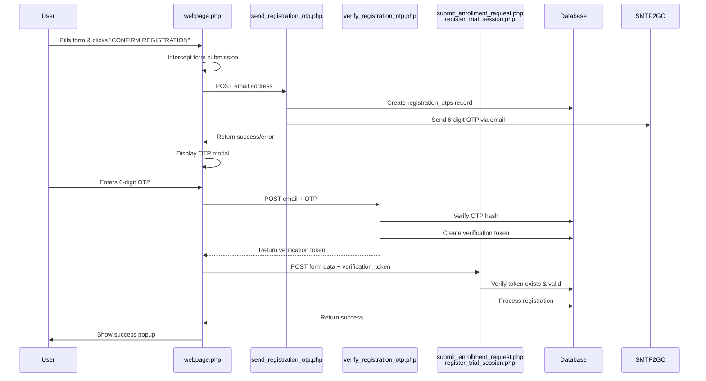

# OTP Email Verification Implementation Plan

## Overview

Add email OTP verification to the registration form. The flow intercepts form submission, sends an OTP to the user's email, displays a modal for OTP input, verifies the code, and then completes the registration.

## Architecture Flow

## Database Tables

### 1. `registration_otps` Table

Stores OTP codes sent to users for email verification.

**Structure:**

- `id` (INT, AUTO_INCREMENT, PRIMARY KEY)
- `email` (VARCHAR(255), NOT NULL)
- `otp_hash` (VARCHAR(255), NOT NULL) - Hashed OTP using password_hash()
- `otp_expires_at` (DATETIME, NOT NULL) - 5 minutes from creation
- `attempt_count` (INT, DEFAULT 0) - Failed verification attempts
- `last_sent_at` (DATETIME, NOT NULL)
- `consumed` (TINYINT(1), DEFAULT 0) - Whether OTP was used
- `created_at` (TIMESTAMP, DEFAULT current_timestamp())
- Index: `idx_email_active` on (`email`, `consumed`)

### 2. `registration_verifications` Table

Stores verification tokens after successful OTP verification.

**Structure:**

- `id` (INT, AUTO_INCREMENT, PRIMARY KEY)
- `email` (VARCHAR(255), NOT NULL)
- `verification_token` (VARCHAR(64), NOT NULL) - 32-byte hex token
- `token_expires_at` (DATETIME, NOT NULL) - 10 minutes from creation
- `created_at` (TIMESTAMP, DEFAULT current_timestamp())
- Index: `idx_email_token` on (`email`, `verification_token`)
- Index: `idx_token` on (`verification_token`)

## File Changes

### New Files

#### 1. `send_registration_otp.php`

**Purpose:** Generate and send OTP to user's email address.

**Key Features:**

- Validates email format
- Rate limiting: Prevents sending OTP more than once per 60 seconds
- Generates 6-digit OTP: `random_int(100000, 999999)`
- Hashes OTP: `password_hash($otp, PASSWORD_DEFAULT)`
- Invalidates previous unconsumed OTPs for the same email
- Creates `registration_otps` table if it doesn't exist
- Sends email via SMTP2GO using existing `sendEmailViaSMTP2GO` pattern from `admin_send_otp.php`
- Returns JSON: `{status: 'success'|'error', message: '...'}`

**Reference:** Pattern from `admin_send_otp.php` (lines 153-224)

#### 2. `verify_registration_otp.php`

**Purpose:** Verify OTP entered by user and generate verification token.

**Key Features:**

- Validates email and OTP from POST data
- Fetches latest active OTP for email (case-insensitive)
- Checks expiration (5 minutes)
- Checks attempt count (max 5 attempts)
- Verifies OTP: `password_verify($otp, $storedHash)`
- On success: Marks OTP as consumed, generates 32-byte hex token, stores in `registration_verifications` table
- Returns JSON: `{status: 'success', verification_token: '...'}` or error message

**Reference:** Pattern from `admin_reset_password.php` (lines 49-195)

### Modified Files

#### 3. `webpage.php`

**Changes:**

**A. Add OTP Modal HTML** (after line 487, before post modal)

- New modal with ID `otpModal` using existing `popup-overlay` and `popup-modal` classes
- Input field for 6-digit OTP (numeric only, maxlength 6, centered text with letter-spacing)
- Error message div (`otpError`)
- Verify and Cancel buttons
- Resend OTP link

**B. Modify Form Submission JavaScript** (replace lines 1293-1365)

- Intercept form submission for both "Enroll" and "Trial Session"
- Extract email from form
- Store form data and target endpoint in variables (`pendingFormData`, `pendingEndpoint`)
- Call `send_registration_otp.php` with email
- On success: Show OTP modal, focus input field
- On error: Show alert

**C. Add OTP Verification Functions** (after line 1284)

- `verifyOTP()`: Validates OTP input, calls `verify_registration_otp.php`, on success submits original form with verification token
- `closeOTPModal()`: Hides modal and resets state
- `resendOTP()`: Calls `send_registration_otp.php` again
- Auto-format OTP input: Remove non-numeric characters, limit to 6 digits
- Enter key support: Submit on Enter keypress

#### 4. `submit_enrollment_request.php`

**Changes:** Add verification token check at the beginning (after line 8, before processing form data)

- Check if `verification_token` exists in POST
- If present: Query `registration_verifications` table to verify token is valid and not expired
- If invalid/expired: Return error JSON
- If valid: Delete token (one-time use) and continue with registration
- For backward compatibility: Log warning if token missing but allow processing (optional - can be strict)

#### 5. `register_trial_session.php`

**Changes:** Same verification token check as `submit_enrollment_request.php`

- Add same token verification logic
- Ensure token is validated before saving trial session request

## Security Features

1. **OTP Hashing:** OTPs stored as `password_hash()`, never plain text
2. **Expiration:** OTP expires in 5 minutes, verification token expires in 10 minutes
3. **Attempt Limiting:** Maximum 5 failed OTP attempts per code
4. **Rate Limiting:** One OTP per email per 60 seconds
5. **Token-Based Verification:** One-time verification token prevents replay attacks
6. **Case-Insensitive Email Matching:** Handles email variations
7. **Input Sanitization:** OTP input strips non-numeric characters

## User Experience Flow

1. User fills registration form
2. Clicks "CONFIRM REGISTRATION"
3. Button shows "SENDING OTP..." (loading state)
4. OTP modal appears: "We've sent a 6-digit OTP code to your email..."
5. User checks email and enters 6-digit code
6. Clicks "VERIFY" → Button shows "VERIFYING..."
7. On success: Form automatically submits, success popup appears
8. On error: Error message shown, user can retry or resend OTP

## Error Handling

- **Invalid email:** Alert before sending OTP
- **OTP send failure:** Error message, user can retry
- **Wrong OTP:** Error message, can retry (max 5 attempts)
- **Expired OTP:** "OTP expired, please request a new one"
- **Too many attempts:** "Too many failed attempts, request new OTP"
- **Resend OTP:** Link in modal to request new code

## Testing Checklist

- [ ] OTP generation and email delivery
- [ ] OTP verification with correct code
- [ ] OTP verification with incorrect code (attempt counting)
- [ ] OTP expiration (after 5 minutes)
- [ ] Rate limiting (60-second cooldown)
- [ ] Verification token validation in registration endpoints
- [ ] Form submission with verification token
- [ ] Resend OTP functionality
- [ ] Modal UI/UX (display, input formatting, error messages)
- [ ] Error handling for all failure scenarios